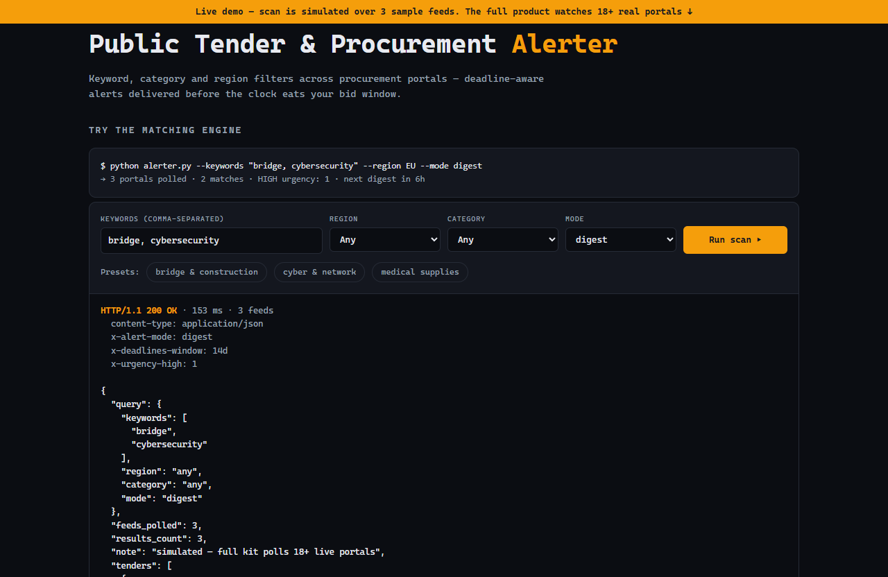

# Public Tender & Procurement Alerter — live demo

  

  <a href="https://amos-mig.github.io/public-tender-procurement-alerter-demo/"><strong>▶ Open the live demo</strong></a> ·
  <a href="https://amosmign.gumroad.com/l/public-tender-procurement-alerter"><strong>Get the full product · €29</strong></a>

## What this is

An interactive simulator of the tender matching engine: enter keywords, region, category and alert mode, and it returns a realistic JSON alert response with deadline-aware urgency ordering and matched-keyword scoring over sample tender feeds. Locked cards and a partial config snippet show what the full kit adds (18+ live portal connectors, email/Slack delivery).

**Try it:** Hit 'Run scan' with the preset keywords, then clear the keywords and run again to see the validation error, or switch region/category to watch the matches filter and reorder by deadline.

## What you get in the full product

- Keyword, category, and region filters across tender portals
- Deadline-aware alerts with urgency ordering
- Structured tender data captured for your bid pipeline
- Digest or instant alert modes
- Single Python file — add your country's portal easily

## About

- **Storefront:** [kits.amosmignery.dev](https://kits.amosmignery.dev) — single-file products, instant download, commercial license
- **Checkout:** [Gumroad](https://amosmign.gumroad.com/l/public-tender-procurement-alerter) (Merchant of Record, VAT handled)
- **Full product:** [Public Tender & Procurement Alerter](https://amosmign.gumroad.com/l/public-tender-procurement-alerter) · €29

## License

The demo page in this repo is MIT-licensed — reuse the technique, not the product.
The **Public Tender & Procurement Alerter** itself is not included here and is not free software.
